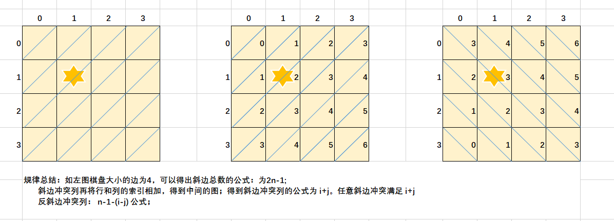

### 收获
#### leetcode150  逆波兰表示法;
> 也称后缀表达式，我们通常运算时，是将运算符号放在中间。而逆波兰实际就是将运算符放在后面。例如中缀为 5 + 3，后缀则为5 3 +；
> 输入：tokens = ["10","6","9","3","+","-11","*","/","*","17","+","5","+"]
> 输出：22
> 解释：该算式转化为常见的中缀算术表达式为：
> ((10 * (6 / ((9 + 3) * -11))) + 17) + 5 
> = ((10 * (6 / (12 * -11))) + 17) + 5 
> = ((10 * (6 / -132)) + 17) + 5 = ((10 * 0) + 17) + 5 
> = (0 + 17) + 5
> = 17 + 5
> = 22
>
> 而计算机中，是采用逆波兰表示法，例如一个java 类，它如果包含运算表达式 c = a + b，那么它在经过编译后实际上就被转成了后缀表达式。这点可以通过 `javap -c -v` 反编译测试。
>
> 字节码大概指令如下：
>
> iload_0
>
> iload_1
>
> iadd
>
> istore_2

#### 二叉树的一些遍历方式
1. 层序遍历 也就是广度优先遍历 结合队列

```java
public List<List<Integer>> levelQuery(TreeNode root) {
        if (root == null) {
            return new ArrayList<>();
        }
        //存放每层node
        List<List<Integer>> levelList = new ArrayList<>();
        //借助队列，先进先出
        Queue<TreeNode> queue = new LinkedList<>();
        queue.offer(root);
        while (!queue.isEmpty()) {
            //存放node
            ArrayList<Integer> nodeList = new ArrayList<>();
            int size = queue.size();
            while (size > 0) {
                BinaryTree.TreeNode tmpNode = queue.poll();
                nodeList.add(tmpNode.val);
                if (tmpNode.leftNode != null) {
                    queue.offer(tmpNode.leftNode);
                }
                if (tmpNode.rightNode != null) {
                    queue.offer(tmpNode.rightNode);
                }
                size--;
            }
            levelList.add(nodeList);
        }
        return levelList;
    }
```

2. 前序遍历，中序遍历，后序遍历 也就是深度优先遍历 结合栈；

```java
import struct.TreeNode;

import java.util.ArrayList;
import java.util.LinkedList;

public List<Integer> preOrder(TreeNode root) {
    if (root == null) {
        return null;
    }
    TreeNode current = root;
    LinkedList<TreeNode> stack = new LinkedList<>();
    List<Integer> list = new ArrayList<>();

    while (!stack.isEmpty() || current != null) {
        if (current != null) {
            stack.push(current);
            list.add(current.val);
            current = current.left;
        } else {
            TreeNode pop = stack.pop();
            current = pop.right;
        }
    }
}
```


#### 动态规划
- [不同路径](src/java/leetcode/editor/cn/UniquePaths62.java)
- [爬楼梯-力扣70](src/java/leetcode/editor/cn/ClimbingStairs70.java)
- [使用最小花费爬楼梯-力扣746](src/java/leetcode/editor/cn/MinCostClimbingStairs746.java)
- [杨辉三角形i-力扣118](src/java/leetcode/editor/cn/PascalsTriangle118.java)
- [**杨辉三角形ii-力扣119**](src/java/leetcode/editor/cn/PascalsTriangleIi119.java)
- **[最长递增子序列-力扣300](src/java/leetcode/editor/cn/LongestIncreasingSubsequence300.java)**
- [不同的二叉搜索树-力扣96(卡特兰数)](src/java/leetcode/editor/cn/UniqueBinarySearchTrees96.java)

1. 零钱兑换问题
- [零钱兑换](src/java/leetcode/editor/cn/CoinChange322.java)
- [零钱兑换2](src/java/leetcode/editor/cn/CoinChangeIi518.java)

2. 打家劫舍问题
- [打家劫舍](src/java/leetcode/editor/cn/HouseRobber198.java)
- [打家劫舍2](src/java/leetcode/editor/cn/HouseRobberIi213.java)
- [打家劫舍3](src/java/leetcode/editor/cn/HouseRobberIii337.java)


3. 股票买卖问题
- [买卖股票的最佳时机-力扣121](src/java/leetcode/editor/cn/BestTimeToBuyAndSellStock121.java)(双指针+贪心思想)
- [买卖股票的最佳时机2-力扣122](src/java/leetcode/editor/cn/BestTimeToBuyAndSellStockIi122.java)(双指针+贪心思想)
- [买卖股票的最佳时机含手续费-力扣714](src/java/leetcode/editor/cn/BestTimeToBuyAndSellStockWithTransactionFee714.java)(动态规划)
- [买卖股票得最佳时期含冷冻期-力扣309](src/java/leetcode/editor/cn/BestTimeToBuyAndSellStockWithCooldown309.java)(动态规划，和第714题一起看)

#### 回溯算法
- [全排列1-力扣46](src/java/leetcode/editor/cn/Permutations46.java)
- [全排列2-力扣47](src/java/leetcode/editor/cn/PermutationsIi47.java)
- [组合-力扣77](src/java/leetcode/editor/cn/Combinations77.java)
- [组合总和-力扣39](src/java/leetcode/editor/cn/CombinationSum39.java)
- [组合总和2-力扣40](src/java/leetcode/editor/cn/CombinationSumIi40.java)
- [组合总和3-力扣216](src/java/leetcode/editor/cn/CombinationSumIii216.java)
- [八皇后-力扣51](src/java/leetcode/editor/cn/NQueens51.java)

八皇后问题图解：



#### 贪心算法
-[柠檬水找零-力扣860](src/java/leetcode/editor/cn/LemonadeChange860.java)


#### 双指针
- [两数之和](src/java/leetcode/editor/cn/TwoSumIiInputArrayIsSorted167.java)
- [三数之和](src/java/leetcode/editor/cn/ThreeSum15.java)
- [移动零-力扣283](src/java/leetcode/editor/cn/MoveZeroes283.java)

#### 单调栈
- [滑动窗口最大值-力扣239](src/java/leetcode/editor/cn/SlidingWindowMaximum239.java)
- [接雨水-力扣42](src/java/leetcode/editor/cn/TrappingRainWater42.java)

#### 二叉树
- [二叉树的所有路径-力扣257](src/java/leetcode/editor/cn/BinaryTreePaths257.java)
- [二叉树的最大深度-力扣104](src/java/leetcode/editor/cn/MaximumDepthOfBinaryTree104.java)
- **[二叉树的直径-力扣543](src/java/leetcode/editor/cn/DiameterOfBinaryTree543.java)**
- [平衡二叉树-力扣110](src/java/leetcode/editor/cn/BalancedBinaryTree110.java)
- [二叉树的最近公共祖先](src/java/leetcode/editor/cn/LowestCommonAncestorOfABinaryTree236.java)
- [从前序与中序遍历序列构造二叉树-力扣105](src/java/leetcode/editor/cn/ConstructBinaryTreeFromPreorderAndInorderTraversal105.java)
- [从中序与后序遍历构造二叉树-力扣106](src/java/leetcode/editor/cn/ConstructBinaryTreeFromInorderAndPostorderTraversal106.java)
- [二叉树展开为链表-力扣114](src/java/leetcode/editor/cn/FlattenBinaryTreeToLinkedList114.java)


#### 二叉搜索树
- [删除二叉搜索树中的节点-力扣450](src/java/leetcode/editor/cn/DeleteNodeInABst450.java)
- [二叉搜索树中的插入操作](src/java/leetcode/editor/cn/InsertIntoABinarySearchTree701.java)
- [二叉搜索树中的众数](src/java/leetcode/editor/cn/FindModeInBinarySearchTree501.java)
- [二叉搜索树的最近公共祖先](src/java/leetcode/editor/cn/ErChaSouSuoShuDeZuiJinGongGongZuXianLcofLCR 193.java)
- [将有序链表转换为二叉搜索树-力扣108](src/java/leetcode/editor/cn/ConvertSortedArrayToBinarySearchTree108.java)

#### 字符串
- [最长公共前缀-力扣14](src/java/leetcode/editor/cn/LongestCommonPrefix14.java)


#### 链表
- [反转链表1-力扣206](src/java/leetcode/editor/cn/ReverseLinkedList206.java)
- [反转链表2-力扣92](src/java/leetcode/editor/cn/ReverseLinkedListIi92.java)
- [两两交换链表中的节点](src/java/leetcode/editor/cn/SwapNodesInPairs24.java)
- **[回文链表-力扣234](src/java/leetcode/editor/cn/PalindromeLinkedList234.java)**
- [相交链表-力扣160](src/java/leetcode/editor/cn/IntersectionOfTwoLinkedLists160.java)
- [删除排序链表中的重复元素-力扣83](src/java/leetcode/editor/cn/RemoveDuplicatesFromSortedList83.java)
- [删除排序链表中的重复元素ii-力扣82](src/java/leetcode/editor/cn/RemoveDuplicatesFromSortedListIi82.java)
- **[k个一组翻转链表-力扣25](src/java/leetcode/editor/cn/ReverseNodesInKGroup25.java)**


#### 堆
- [前k个高频元素-力扣347](src/java/leetcode/editor/cn/TopKFrequentElements347.java)